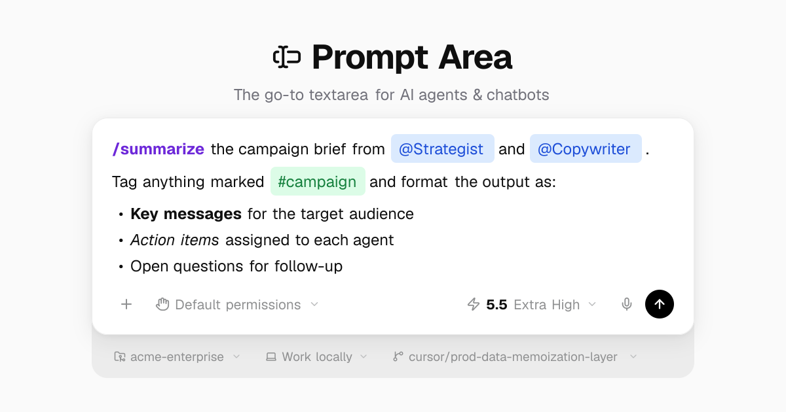

# Prompt Area

A production-grade `contentEditable` rich text input. Install it **two ways from the same source**: an [npm package](https://www.npmjs.com/package/prompt-area) (`npm install prompt-area`) or a [shadcn registry](https://ui.shadcn.com/docs/registry) component you copy into your repo. Dependency-light either way.

**Try it live:** [run the example in your browser](https://prompt-area.com/docs/try-it-live) — a full Vite + React app, no setup ([source](examples/basic)).



<a href="https://www.producthunt.com/products/prompt-area?utm_source=badge-featured&utm_medium=badge" target="_blank">
  
</a>

## Why Prompt Area?

Most rich text editors are full document editors shoehorned into chat inputs. Prompt Area is purpose-built for **prompt-style inputs** — think ChatGPT, Linear, Slack composer boxes — where you need mentions, slash commands, markdown, and chips without pulling in a heavyweight editor framework.

- **Zero extra dependencies** — no ProseMirror, Slate, or Lexical; just React + your stack
- **Two distribution models** — `npm install` for a versioned package, or shadcn to own the source
- **Tiny surface area** — one component, one hook, done

## Install

### npm package

```bash
npm install prompt-area
```

```tsx
'use client'
import { PromptArea } from 'prompt-area'
import 'prompt-area/styles.css'
```

The package ships a prebuilt, self-contained `styles.css` (no Tailwind required) plus an optional `prompt-area/tailwind.css` preset for token-level theming. `clsx` and `tailwind-merge` are peer dependencies (zero bundled runtime deps) — npm/pnpm/bun install them automatically; on yarn run `yarn add prompt-area clsx tailwind-merge`. See [`packages/prompt-area/README.md`](packages/prompt-area/README.md) for the full guide.

### shadcn registry

Prefer to own the source? Copy it into your project:

```bash
npx shadcn@latest add https://prompt-area.com/r/prompt-area.json
```

### Install with AI coding agents

Copy this prompt and give it to your AI coding agent (Claude Code, Codex, Cursor, etc.). It reads the [machine-readable docs](https://prompt-area.com/llms-full.txt), installs Prompt Area (npm by default, or the shadcn registry if you ask for it), and wires it into your app — replacing any existing chat input or scaffolding a new one:

```text
Install Prompt Area — a production-grade React chat/prompt input (@mentions, /commands, #tags, inline markdown, file attachments) — into this project. Do the full integration yourself; don't just print instructions.

1. Read the docs first. Fetch https://prompt-area.com/llms-full.txt and read it in full. It is the source of truth for the API, props, triggers, helpers, and required CSS — use it, don't guess.

2. Detect the project's package manager from its lockfile (npm, yarn, pnpm, or bun) and use it for every install and CLI command below.

3. Choose how to install, and default to the npm package:
   - npm package (default): add prompt-area with the detected package manager, then import { PromptArea } from 'prompt-area' and import 'prompt-area/styles.css' once at the app root. No Tailwind required.
   - shadcn: only if this project already uses shadcn/ui (a components.json exists) AND I explicitly ask for it — run shadcn@latest add https://prompt-area.com/r/prompt-area.json with the detected package manager's runner (npx, pnpm dlx, yarn dlx, or bunx), then add the .prompt-area-* component classes from the docs to globals.css.
   If it is ambiguous, ask me once which I want; otherwise use the npm package.

4. Wire it into the app. If a chat/prompt composer (or a <textarea> used as one) already exists, replace it with PromptArea, keeping the existing submit, placeholder, and send/attach controls, and connect @mentions, /commands, or #tags to real project data when it is obvious (otherwise leave a clearly marked stub). If there is no composer yet, scaffold a minimal working one from the Quick Start — controlled state via usePromptAreaState and an onSubmit that sends the plain text.

5. Verify your work. Make sure the project typechecks and builds, fix any import or CSS wiring, then show me the final component and how to run it.
```

<details>
<summary>Add the required CSS classes to your <code>globals.css</code> after <code>@layer base</code></summary>

```css
@layer components {
  .prompt-area-chip {
    display: inline-flex;
    align-items: center;
    padding: 1px 6px;
    border-radius: 4px;
    font-size: 0.875rem;
    font-weight: 500;
    cursor: pointer;
    user-select: none;
    vertical-align: baseline;
    margin: 0 1px;
    background-color: var(--secondary);
    color: var(--foreground);
  }
  .prompt-area-md-marker {
    font-size: 0;
    display: inline;
  }
  .prompt-area-chip--inline {
    padding: 0;
    border-radius: 0;
    margin: 0;
    font-weight: 700;
  }
}
```

</details>

## Quick Start

```tsx
'use client'

import { useState } from 'react'
import { PromptArea } from '@/components/prompt-area'
import type { Segment, TriggerConfig } from '@/components/types'

const triggers: TriggerConfig[] = [
  {
    char: '@',
    position: 'any',
    mode: 'dropdown',
    onSearch: (query) =>
      [
        { value: 'alice', label: 'Alice' },
        { value: 'bob', label: 'Bob' },
      ].filter((u) => u.label.toLowerCase().includes(query.toLowerCase())),
  },
]

export function Chat() {
  const [segments, setSegments] = useState<Segment[]>([])

  return (
    <PromptArea
      value={segments}
      onChange={setSegments}
      triggers={triggers}
      placeholder="Type @ to mention someone..."
      onSubmit={(segs) => {
        console.log('Submitted:', segs)
        setSegments([])
      }}
    />
  )
}
```

## Comparison

How Prompt Area stacks up against popular alternatives:

> **Legend:** :white_check_mark: Full support :large_orange_diamond: Partial :x: None

| Feature                      |      Prompt Area      |     react-mentions     |         Tiptap         |        Lexical         |        Plate.js        |       BlockNote        |       BlockSuite       | react-textarea-autosize |
| ---------------------------- | :-------------------: | :--------------------: | :--------------------: | :--------------------: | :--------------------: | :--------------------: | :--------------------: | :---------------------: |
| @Mentions / Tagging          |  :white_check_mark:   |   :white_check_mark:   | :large_orange_diamond: | :large_orange_diamond: |   :white_check_mark:   | :large_orange_diamond: |   :white_check_mark:   |           :x:           |
| Slash Commands               |  :white_check_mark:   |          :x:           |   :white_check_mark:   |          :x:           |   :white_check_mark:   |   :white_check_mark:   |   :white_check_mark:   |           :x:           |
| Auto-grow on Focus           |  :white_check_mark:   |          :x:           |          :x:           |          :x:           |          :x:           |          :x:           |          :x:           |   :white_check_mark:    |
| Inline Markdown              |  :white_check_mark:   |          :x:           |   :white_check_mark:   |   :white_check_mark:   |   :white_check_mark:   | :large_orange_diamond: |   :white_check_mark:   |           :x:           |
| Undo / Redo                  |  :white_check_mark:   |          :x:           |   :white_check_mark:   |   :white_check_mark:   |   :white_check_mark:   |   :white_check_mark:   |   :white_check_mark:   |           :x:           |
| File & Image Attachments     |  :white_check_mark:   |          :x:           | :large_orange_diamond: |          :x:           | :large_orange_diamond: |   :white_check_mark:   |   :white_check_mark:   |           :x:           |
| Dark Mode                    |  :white_check_mark:   |          :x:           |          :x:           |          :x:           |   :white_check_mark:   |   :white_check_mark:   | :large_orange_diamond: |           :x:           |
| Accessibility (ARIA)         |  :white_check_mark:   | :large_orange_diamond: | :large_orange_diamond: |   :white_check_mark:   |   :white_check_mark:   | :large_orange_diamond: | :large_orange_diamond: |   :white_check_mark:    |
| IME Support (CJK)            |  :white_check_mark:   | :large_orange_diamond: |   :white_check_mark:   |   :white_check_mark:   | :large_orange_diamond: | :large_orange_diamond: | :large_orange_diamond: |   :white_check_mark:    |
| Copy/Paste Chip Preservation |  :white_check_mark:   |          :x:           | :large_orange_diamond: | :large_orange_diamond: | :large_orange_diamond: |   :white_check_mark:   |   :white_check_mark:   |           :x:           |
| Action Bar / Toolbar         |  :white_check_mark:   |          :x:           | :large_orange_diamond: |          :x:           |   :white_check_mark:   |   :white_check_mark:   |   :white_check_mark:   |           :x:           |
| Zero-config State Hook       |  :white_check_mark:   |          :x:           |          :x:           |          :x:           |          :x:           |   :white_check_mark:   |          :x:           |           :x:           |
| Bundle Approach              | npm + shadcn registry |      npm package       |      npm package       |      npm package       |      npm package       |      npm package       |      npm package       |       npm package       |
| Extra Dependencies           |         **0**         |           0            |           3+           |           2+           |           5+           |           5+           |           5+           |            0            |

## Features

- **Trigger-based chips** — Type `@`, `/`, `#` (or any character) to activate dropdowns or callbacks
- **Immutable chip pills** — Resolved mentions, commands, and tags render as non-editable chips
- **Inline markdown** — Live preview of `**bold**`, `*italic*`, and `***bold-italic***`
- **URL detection** — Auto-links URLs with Cmd/Ctrl+Click to open
- **List auto-formatting** — Type `- ` or `* ` to start bullet lists with Tab/Shift+Tab indentation
- **Undo/redo** — Full history with debounced snapshots
- **Copy/paste** — Preserves chip data internally, auto-resolves triggers on external paste
- **IME support** — Proper composition handling for CJK input
- **Auto-grow** — Expands on focus, shrinks on blur
- **File & image attachments** — Paste screenshots or attach files with thumbnails, loading states, and remove buttons
- **Rotating placeholders** — Pass a `string[]` placeholder to animate between texts
- **Keyboard shortcuts** — Bold, italic, submit, dismiss, and more
- **Imperative API** — `focus()`, `blur()`, `insertChip()`, `getPlainText()`, `clear()`
- **DX helpers** — `usePromptAreaState()` hook, trigger presets, and segment helpers

## API Reference

### `PromptAreaProps`

| Prop            | Type                               | Default        | Description                                                  |
| --------------- | ---------------------------------- | -------------- | ------------------------------------------------------------ |
| `value`         | `Segment[]`                        | required       | Controlled segment array                                     |
| `onChange`      | `(segments: Segment[]) => void`    | required       | Called on content changes                                    |
| `triggers`      | `TriggerConfig[]`                  | `[]`           | Trigger character configurations                             |
| `placeholder`   | `string \| string[]`               | —              | Placeholder text when empty; an array animates between items |
| `className`     | `string`                           | —              | CSS class for the container                                  |
| `disabled`      | `boolean`                          | `false`        | Disable the input                                            |
| `markdown`      | `boolean`                          | —              | Enable inline markdown rendering                             |
| `onSubmit`      | `(segments: Segment[]) => void`    | —              | Called on Enter (without Shift)                              |
| `onEscape`      | `() => void`                       | —              | Called on Escape                                             |
| `onChipClick`   | `(chip: ChipSegment) => void`      | —              | Called when a chip is clicked                                |
| `onChipAdd`     | `(chip: ChipSegment) => void`      | —              | Called when a chip is added                                  |
| `onChipDelete`  | `(chip: ChipSegment) => void`      | —              | Called when a chip is deleted                                |
| `onLinkClick`   | `(url: string) => void`            | —              | Called on Cmd/Ctrl+Click on a URL                            |
| `onPaste`       | `(data) => void`                   | —              | Called after paste with segments and source                  |
| `onUndo`        | `(segments: Segment[]) => void`    | —              | Called after undo                                            |
| `onRedo`        | `(segments: Segment[]) => void`    | —              | Called after redo                                            |
| `minHeight`     | `number`                           | `80`           | Minimum height in pixels                                     |
| `maxHeight`     | `number`                           | —              | Maximum height in pixels                                     |
| `autoFocus`     | `boolean`                          | `false`        | Auto-focus on mount                                          |
| `autoGrow`      | `boolean`                          | `false`        | Expand on focus, shrink on blur                              |
| `aria-label`    | `string`                           | `'Text input'` | Accessible label                                             |
| `data-test-id`  | `string`                           | —              | Test ID for e2e testing                                      |
| `images`        | `PromptAreaImage[]`                | —              | Image attachments to display                                 |
| `imagePosition` | `'above' \| 'below'`               | `'above'`      | Image strip placement relative to the text                   |
| `onImagePaste`  | `(file: File) => void`             | —              | Called when an image is pasted                               |
| `onImageRemove` | `(image: PromptAreaImage) => void` | —              | Called when an image's remove button is clicked              |
| `onImageClick`  | `(image: PromptAreaImage) => void` | —              | Called when an image thumbnail is clicked                    |
| `files`         | `PromptAreaFile[]`                 | —              | File attachments to display                                  |
| `filePosition`  | `'above' \| 'below'`               | `'above'`      | File strip placement relative to the text                    |
| `onFileRemove`  | `(file: PromptAreaFile) => void`   | —              | Called when a file's remove button is clicked                |
| `onFileClick`   | `(file: PromptAreaFile) => void`   | —              | Called when a file attachment is clicked                     |

### `PromptAreaHandle` (ref)

```tsx
const ref = useRef<PromptAreaHandle>(null)

<PromptArea ref={ref} ... />

ref.current.focus()          // Focus the editor
ref.current.blur()           // Blur the editor
ref.current.insertChip(chip) // Insert a chip at cursor position
ref.current.getPlainText()   // Get plain text content
ref.current.clear()          // Clear all content and undo history
```

### `TriggerConfig`

| Field                | Type                                                                         | Description                                                                            |
| -------------------- | ---------------------------------------------------------------------------- | -------------------------------------------------------------------------------------- |
| `char`               | `string`                                                                     | Trigger character (e.g., `'@'`, `'/'`, `'#'`)                                          |
| `position`           | `'start' \| 'any'`                                                           | Where the trigger is valid                                                             |
| `mode`               | `'dropdown' \| 'callback'`                                                   | Show dropdown or fire callback                                                         |
| `onSearch`           | `(query, { signal }) => TriggerSuggestion[] \| Promise<TriggerSuggestion[]>` | Fetch suggestions (dropdown mode); `signal` aborts superseded searches                 |
| `onSelect`           | `(suggestion) => string \| void`                                             | Customize chip display text                                                            |
| `onActivate`         | `(context) => void`                                                          | Handler for callback mode                                                              |
| `resolveOnSpace`     | `boolean`                                                                    | Auto-resolve on space (e.g., `#tag`)                                                   |
| `chipStyle`          | `'pill' \| 'inline'`                                                         | Visual style for chips                                                                 |
| `chipClassName`      | `string`                                                                     | CSS class for chips                                                                    |
| `accessibilityLabel` | `string`                                                                     | ARIA label for the trigger                                                             |
| `searchDebounceMs`   | `number`                                                                     | Debounce before `onSearch` (default `0`; first empty-query search is always immediate) |
| `onSearchError`      | `(error: unknown) => void`                                                   | Called when `onSearch` rejects (non-abort errors)                                      |
| `emptyMessage`       | `string`                                                                     | Dropdown message for empty results (popover hides if unset)                            |

### `Segment`

```ts
type Segment = TextSegment | ChipSegment

type TextSegment = { type: 'text'; text: string }

type ChipSegment = {
  type: 'chip'
  trigger: string // e.g., '@'
  value: string // e.g., 'user-123'
  displayText: string // e.g., 'Alice'
  data?: unknown
  autoResolved?: boolean
}
```

## DX Helpers

`usePromptAreaState()` wires up the segment state, ref, and derived values, and trigger presets replace hand-written configs:

```tsx
import { PromptArea } from '@/components/prompt-area'
import { usePromptAreaState } from '@/components/use-prompt-area-state'
import { mentionTrigger, commandTrigger, hashtagTrigger } from '@/components/trigger-presets'
import { getChipsByTrigger } from '@/components/segment-helpers'

function ChatInput() {
  const { bind, plainText, isEmpty, chips, clear, focus } = usePromptAreaState()
  const mentions = getChipsByTrigger(bind.value, '@')

  return (
    <PromptArea
      {...bind}
      triggers={[
        mentionTrigger({ onSearch: searchUsers }),
        commandTrigger({ onSearch: searchCommands }),
        hashtagTrigger(),
      ]}
      onSubmit={() => {
        sendMessage(plainText, mentions)
        clear()
      }}
    />
  )
}
```

Also available: `callbackTrigger()` for callback-mode triggers, and segment helpers — `text()`, `chip()`, `isSegmentsEmpty()`, `hasChips()`, `getChips()`, `segmentsToPlainText()`, `plainTextToSegments()`. See [llms-full.txt](https://prompt-area.com/llms-full.txt) for the complete reference.

## Chip Customization

Style chips per-trigger using `chipClassName` and `chipStyle`:

```tsx
const triggers: TriggerConfig[] = [
  {
    char: '/',
    position: 'start',
    mode: 'dropdown',
    chipStyle: 'inline',
    chipClassName: 'text-violet-700 dark:text-violet-400',
    onSearch: searchCommands,
  },
  {
    char: '@',
    position: 'any',
    mode: 'dropdown',
    chipClassName: 'bg-blue-100 text-blue-700 dark:bg-blue-900 dark:text-blue-300',
    onSearch: searchUsers,
  },
]
```

## Keyboard Shortcuts

| Shortcut            | Action                                   |
| ------------------- | ---------------------------------------- |
| `Enter`             | Submit (or continue list)                |
| `Shift+Enter`       | Insert newline                           |
| `Escape`            | Dismiss dropdown / fire onEscape         |
| `Cmd/Ctrl+B`        | Toggle **bold**                          |
| `Cmd/Ctrl+I`        | Toggle _italic_                          |
| `Cmd/Ctrl+Z`        | Undo                                     |
| `Cmd/Ctrl+Shift+Z`  | Redo                                     |
| `Tab` / `Shift+Tab` | Indent / outdent list item               |
| `ArrowUp/Down`      | Navigate dropdown suggestions            |
| `Backspace` on chip | Delete chip (or revert if auto-resolved) |

## Development

This is a pnpm workspace: the `prompt-area` npm package lives in `packages/prompt-area`, and the docs/demo site (the repo root) consumes it.

```bash
pnpm install            # Install dependencies (pnpm required)
pnpm dev                # Start the docs site (Next.js + Turbopack)
pnpm test               # Run tests (Vitest)
pnpm lint               # Lint with ESLint
pnpm typecheck          # Type-check the docs site
pnpm build              # Production build of the docs site
pnpm registry:build     # Build shadcn registry JSON

pnpm package:build      # Build the npm package (ESM + .d.ts + CSS)
pnpm package:typecheck  # Type-check the package
pnpm package:check      # Validate package exports & types (publint + attw)
```

### Project Structure

```
packages/prompt-area/        # The npm package (single source of truth)
├── src/
│   ├── prompt-area/             # Core component
│   │   ├── prompt-area.tsx          # Main component + rendering
│   │   ├── types.ts                 # All type definitions
│   │   ├── prompt-area-engine.ts    # contentEditable engine
│   │   ├── prompt-area-list-ops.ts  # List auto-formatting operations
│   │   ├── use-prompt-area.ts        # State management hook
│   │   ├── use-prompt-area-events.ts # Event handlers
│   │   ├── use-prompt-area-state.ts  # Zero-config state hook
│   │   ├── use-trigger-search.ts     # Trigger/search logic
│   │   ├── trigger-popover.tsx       # Dropdown popover
│   │   ├── trigger-presets.ts        # Pre-built trigger configs
│   │   ├── dom-helpers.ts            # DOM utilities
│   │   ├── cursor-helpers.ts         # Cursor/selection utilities
│   │   ├── clipboard-helpers.ts      # Chip-preserving copy/paste
│   │   ├── segment-helpers.ts        # Segment manipulation
│   │   └── __tests__/                # Unit tests
│   ├── action-bar/             # Toolbar component
│   ├── status-bar/             # Status display component
│   ├── compact-prompt-area/    # Pill-shaped collapsible variant
│   ├── chat-prompt-layout/     # Chat UI layout component
│   ├── helpers/                # Server-safe re-exports
│   ├── styles/                 # Tokens, theme mappings, component CSS
│   └── index.ts                # Public barrel
├── tsup.config.ts              # Library build (ESM + .d.ts)
└── package.json                # exports map, peer deps

app/                            # Docs + demo site (Next.js)
├── page.tsx                    # Landing page
├── examples/                   # 20+ interactive demos
└── sections/                   # Landing page sections

registry.json                   # shadcn registry, built from packages/prompt-area/src
```

## Related Projects

- [Agency Skills](https://github.com/just-marketing/agency-skills) — A sibling open-source project by Juma: a library of Claude Code skills that give marketing agencies repeatable, deliverable-oriented workflows for audits, strategy, content, reporting, and operations.

## License

MIT
